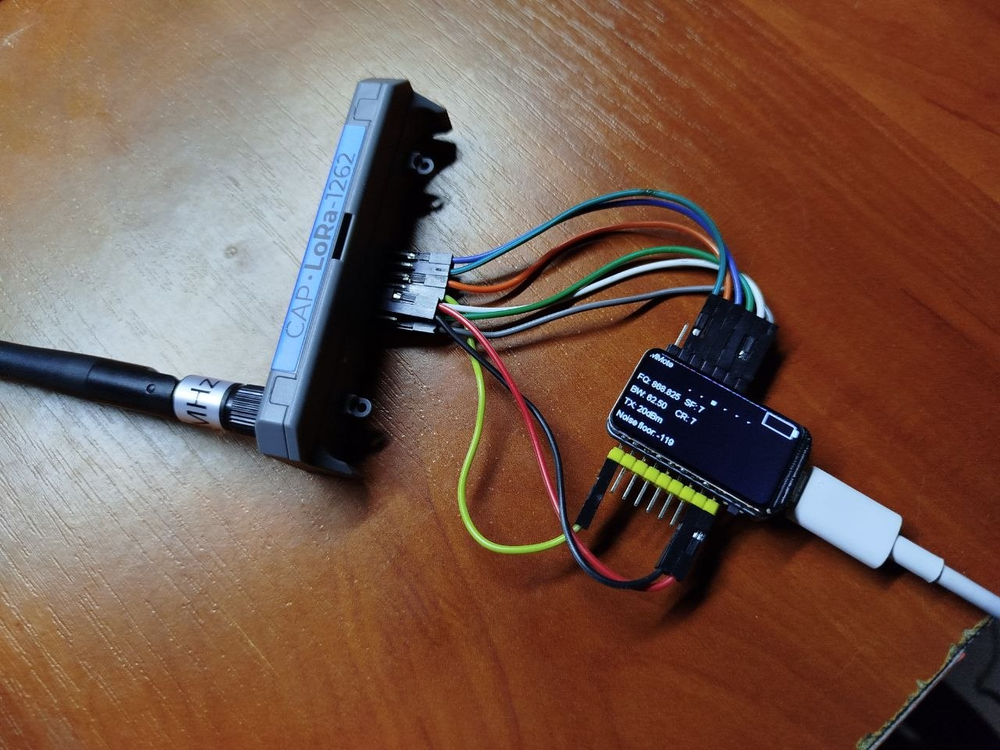

# Waveshare ESP32-C6-LCD-1.47 with SX1262 variant

Module info: https://www.waveshare.com/wiki/ESP32-C6-LCD-1.47

Tested with `CAP LoRa-1262` for `Cardputer ADV`.

Connections:

| Description        | PIN    |
| ------------------ |--------|
| SX1262 SCK         | GPIO5  |
| SX1262 MISO        | GPIO18 |
| SX1262 MOSI        | GPIO19 |
| SX1262 NSS         | GPIO20 |
| SX1262 DIO_1 (IRQ) | GPIO23 |
| SX1262 BUSY        | GPIO12 |
| SX1262 RESET       | GPIO13 |

On-board button in connected to GPIO9.



Some things may not work, I've made this as a temporary solution.

To build, clone https://github.com/meshcore-dev/MeshCore and copy "variants/waveshare-esp32-c6-lcd-1.47-sx1262" of this repository to "MeshCore/variants".

With `CAP LoRa-1262` you also need to enable radio with IO expansion chip:

```c
Wire.setPins(PIN_BOARD_SDA, PIN_BOARD_SCL);
Wire.begin();

Wire.beginTransmission(0x43);  // PI4IOE5V6408ZTAEX Address
Wire.write(0x03); // Direction
Wire.write(0x01); // Output
Wire.endTransmission();

Wire.beginTransmission(0x43);
Wire.write(0x07); // High-impedance
Wire.write(0x00); // Disable high-impedance so pin can actually drive
Wire.endTransmission();

Wire.beginTransmission(0x43);
Wire.write(0x05); // IO set
Wire.write(0x01); // High Level
Wire.endTransmission();
```

